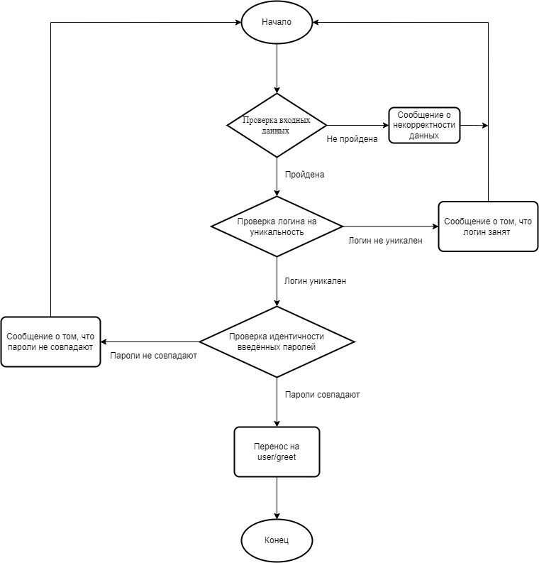
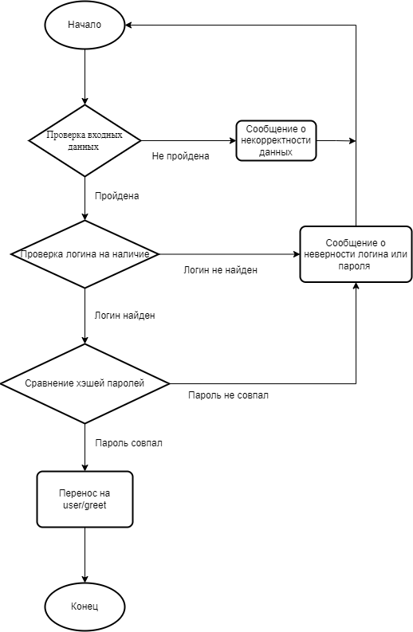
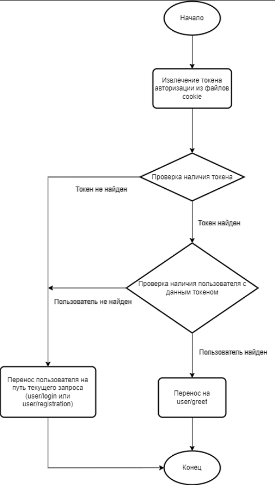

# Отчёт к лабораторной работе №1

----
# Текст задания
## Цель работы
Спроектировать и разработать систему авторизации пользователей на протоколе HTTP
## Минимальные требования
- функциональность входа/выхода
- хранение паролей в хэшированном виде 
## Дополнительные возможности
- форма регистрации
- смена пароля
- восстановление пароля
- ограничение времени сессии (на сервере)
 - ограничение срока действия пароля (на сервере)
 - валидация пароля (на сервере)
 - хранение хэша пароля с солью
 - возможность одновременного использования пользователем нескольких клиентов
 ## Выполнено
 - функциональность входа/выхода
- хранение паролей в хэшированном виде
- форма регистрации
- ограничение времени сессии (на сервере)
- валидация пароля (на сервере)
 - хранение хэша пароля с солью 

 ----
# Ход работы
## Пользовательский интерфейс
Необходимо создать три страницы: страницу регистрации, страницу входа и основную страницу сайта
1. Страница входа


2. Страница регистрации


3. Главная страница сайта


## Пользовательские сценарии работы
1. При вводе в адресной строке /api/user/registration, если пользователь не авторизован, то он переносится на форму регистрации 
    - При вводе не занятого логина и пароля, удовлетворяющего минимальным требованиям безопасности, пользователь переносится на основную страницу сайта /api/user/greet
    - Если введённый логин занят, пользователю выводится сообщение "Пользователь с таким именем уже существует"
    - Если пароль не удовлетворяет требованиям, выводится одно из двух сообщений: "Пароль должен содержать не менее 6 символов", "Пароль должен содержать хотя бы один символ, не являющийся цифрой"
    - Если пароли не совпадают, то выводится сообщение "Введённые пароли не совпадают" 
2. При вводе в адресной строке /api/user/login, если пользователь не авторизован, то он переносится на форму входа
    - При вводе существующего логина и пароля, удовлетворяющего минимальным требованиям безопасности пользователь переносится на основную страницу сайта /api/user/greet
    - Если пользователь с введённым логином не найден, выводится сообщение "Пользователь с таким именем не найден"
    - Если введён неверный пароль, выводится сообщение "Неверный пароль"
4. При вводе в адресной строке /api/user/greet, если пользователь не авторизован, он переносится на форму регистрации
5. При вводе в адресной строке /api/user/registration, /api/user/login или /api/user/greet, если пользователь авторизован, он переносится на основную страницу сайта /api/user/greet

## Описание API сервера, хореографии
В основе приложения использована клиент-серверная архитектуре. Обмен данными между клиентом и сервером осуществляется с помощью HTTP GET и POST запросов. В теле POST запроса для авторизации используются следующие поля: login, password. Для регистрации добавляется поле rep_password. Для сохранения данных на стороне клента используются cookie файлы.
1. Описание процесса авторизации: Клиент отправляет GET запрос на получение страницы по адресу /api/user/login. Функция аутентификации проверяет наличие токена авторизации в файлах cookie, если таковой имеется - перенаправление по адресу /api/user/greet. Иначе если нет ошибок, сервер обрабатывает запрос и возвращает ответ. При отправке данных POST запросом проверяется их корректность (отсутствие HTML символов), в случае некорректности выводится сообщение об этом. Далее данные из полей login и password сверяются с имеющимися в БД. В случае успеха происходит перенаправление по адресу /api/user/greet, иначе выводится сообщение "Неверный логин или пароль".
2. Описание процесса регистрации: Клиент отправляет GET запрос на получение страницы по адресу /api/user/registration. Функция аутентификации проверяет наличие токена авторизации в файлах cookie, если таковой имеется - перенаправление по адресу /api/user/greet. Иначе если нет ошибок, сервер обрабатывает запрос и возвращает ответ. При отправке данных POST запросом проверяется их корректность (валидность пароля, отсутствие HTML символов), в случае некорректности выводится сообщение об этом. После данные из поля login сверяются с имеющимися в БД. Если логин не уникален, выводится сообщение "Пользователь с таким именем уже существует". Введённые пароли сравниваются между собой. Если они не совпадают, выводится сообщение "Введённые пароли не совпадают". Пароль хэшируется и заносится в БД. Происходит перенаправление по адресу /api/user/greet.
3. Описание функции аутентификации: Имеется два варианта функции: Cервер запрашивает файлы cookie от клиента и извлекает из них токен авторизации. Если токен не найден, пользователь перенаправляется по адресу /api/user/registration, либо по адресу /api/user/login (если запрос от пользователя по этому адресу). В ином случае пользователь перенаправляется по адресу /api/user/greet.
## Описание структуры базы данных
База данных представляет собой одну таблицу users со следующими столбцами:
1. "id": тип integer с автоинкрементацией при внесении нового пользователя;
2. "login" тип string, уникален, хранит логин пользователя;
3. "password" тип string, хранит хэш пароля;
4. "token" тип string, уникален, хранит токен авторизации пользователя;
5. "role" тип string, хранит роль пользователя, по умолчанию значение "USER".
Администрирование базы данных осуществлялось с помощью приложения MySQL Workbench.
## Описание алгоритмов
1. Алгоритм регистрации



2. Алгоритм авторизаации



3. Алгоритм аутентификации



4. Алгоритм выхода


----
# Примеры HTTP запросов/ответов
Регистрация: сценарий с верными данными


Регистрация: сценарий с неверными данными


Авторизация: сценарий с верными данными


Авторизация: сценарий с неверными данными


Аутентификация: сценарий с токеном


Аутентификация: сценарий без токена


----
# Значимые фрагменты кода
1. Алгоритм авторизации
```javascript
async login(req, res, next) {
    try {
        const errors = validationResult(req);
        if(!errors.isEmpty()) {
            const fstError = errors.array({ onlyFirstError: true })[0];
            console.log(fstError);
            return res.render('login', {
                error: true,
                msg: fstError.msg,
                layout: false,
            });
        }
        const {login, password} = req.body;
        if(!login || !password) {
            return next(ApiError.badRequest("Некорректный login или password!"));
        }
        const user = await User.findOne({where: {login: login}});
        let comparePassword;
        if(user) comparePassword = await bcrypt.compare(password, user.password);
        if (!user || !comparePassword) {
            return res.render('login', {
                userCheck: true,
                msg: "Неверный логин или пароль",
                layout: false,
            });
        }
        const token = generateJWT(user.id, user.login, user.role);
        await User.update({token: token}, {where: {
                login: user.login
            }});
        return res.status(303).cookie('token', token, {
            maxAge: 12*3600,
            secure: true,
            httpOnly: true
        }).redirect('greet');
    } catch(e) {
        console.log(e);
        res.status(500).json({message:"Login error!"});
    }
}
```
2. Алгоритм регистрации
```javascript
async registration(req, res, next) {
    try {
        const errors = validationResult(req);
        if(!errors.isEmpty()) {
            const fstError = errors.array({ onlyFirstError: true })[0];
            console.log(fstError);
            return res.render('registration', {
                error: true,
                msg: fstError.msg,
                layout: false,
            });
        }
        console.log(req.body);
        const {login, password, rep_password, role} = req.body;
        if(!login || !password || !rep_password) {
            return res.status(520).json({message:"Unknown error!"});
        }
        const candidate = await User.findOne({where: {login: login}});
        if (candidate) {
            return res.render('registration', {
                userExist: true,
                msg: "Пользователь с таким именем уже существует",
                layout: false,
            });
        }
        if (password !== rep_password) {
            return res.render('registration', {
                unMatch: true,
                msg: "Введённые пароли не совпадают",
                layout: false,
            });
        }
        const hashPassword = await bcrypt.hash(password, 5);
        let user = await User.create({login, role, password: hashPassword});
        const token = generateJWT(user.id, user.login, user.role);
        await User.update({token: token}, {where: {
            login: user.login
        }});
        return res.status(303).cookie('token', token, {
            maxAge: 12*3600,
            secure: true,
            httpOnly: true
        }).redirect('greet');
    } catch(e) {
        console.log(e);
        res.status(500).json({message:"Registration error!"});
    }
}
```
3. Алгоритм аутентификации
```javascript
module.exports = function (req, res, next) {
    if(req.method === 'OPTIONS') {
        next();
    }
    try {
        const token = req.cookies.token;
        if(!token) {
            next();
        } else {
            const candidate = User.findOne({where: {token: token}});
            if(candidate) {
                return res.status(303).cookie('token', token, {
                    maxAge: 12*3600,
                    secure: true,
                    httpOnly: true,
                }).redirect('greet');
            } else {
                next();
            }
        }
    } catch(e) {
        return res.status(401).json({message:"Authorization error"});
    }
};
```
4. Алгоритм выхода
```javascript
async logout(req, res) {
    try {
        const login = req.login;
        await User.update({token: null}, {where: {
            login: login
        }});
        res.clearCookie('token');
        return res.redirect('registration');
    } catch(e) {
        console.log(e);
        res.status(500).json({message:"Logout error!"});
    }
}
```

